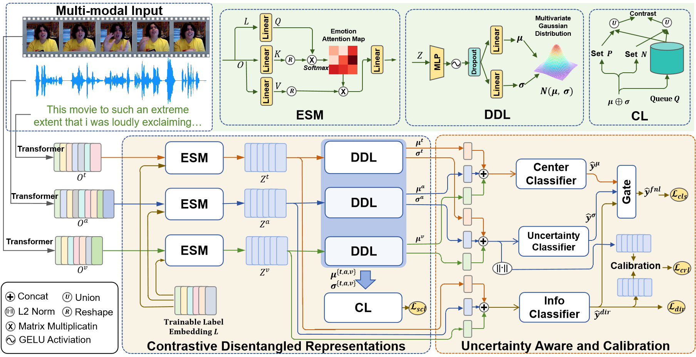

# Latent Distribution Decoupling: A Probabilistic Framework for Uncertainty-Aware Multimodal Emotion Recognition
[\[Paper\]](https://arxiv.org/abs/2502.13954)

This is the homepage for Latent Distribution Decoupling: A Probabilistic Framework for Uncertainty-Aware Multimodal Emotion Recognition.

We propose a new framework name lddu based on the latent emotion space modeling and uncertainty learning. the proposed framework consists of three components: (1) the transformer-base unimodal extractor (2) a contrastive learning-based emotion space decomposition module and (3) an uncertainty-aware fusion and uncertainty calibration module.*



Authors: [Jiangwang Huang](huangjiangwang@stu.cqu.edu.cn), [KaiWen Wei](weikaiwen@cqu.edu.cn), [Jiang Zhong](zhongjiang@cqu.edu.cn) at el.

## Quick Links:
- [Requirements](#requirements)
- [Dataset](#dataset)
- [Training and Inference](#training-and-inference)
- [Citation](#citation)

## Release Progress
- Training code
- Data and data preparation
- Training readme

## Requirements
Please install all the requirements by running `pip install -r requirements.txt`, other requirments package just need to be install follow the error tips.
```bash
pip install -r requirement
```
## Dataset
### CMU-MOSEI
the dataset can be downloaded from [here](https://drive.google.com/drive/folders/1umLIjIlL8Y1oWYzU2L6UyPTHFQx7RREB). Please download the aligned data and unaligned data to "./dataset/dataset1/". Then run the script:
```bash
cd ./dataset
python data_process.py
```
The download dataset is without target labels match for training, to get ground truth, you can process by yourself, or use processed groud truth file from "./dataset/dataset1/label.csv"

### ME3D
The processed features of M3ED is provided by [carat](https://github.com/chengzju/CARAT.git). You can contact the authors of CARAT to obtain the related features.

More details about CMU-MOSEI and M3ED datasets will be released soon after the paper is officially published.

## Training and Inference 

```bash
sh trian.sh
```
## Citation
```code
@misc{huang2025latentdistributiondecouplingprobabilistic,
      title={Latent Distribution Decoupling: A Probabilistic Framework for Uncertainty-Aware Multimodal Emotion Recognition}, 
      author={Jingwang Huang and Jiang Zhong and Qin Lei and Jinpeng Gao and Yuming Yang and Sirui Wang and Peiguang Li and Kaiwen Wei},
      year={2025},
      eprint={2502.13954},
      archivePrefix={arXiv},
      primaryClass={cs.CL},
      url={https://arxiv.org/abs/2502.13954}, 
}
```
