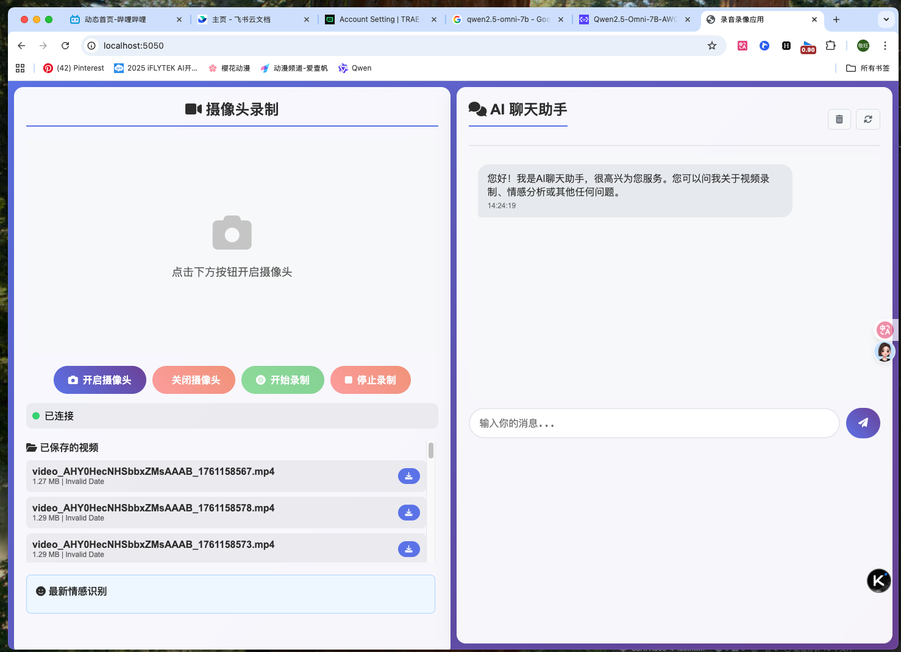
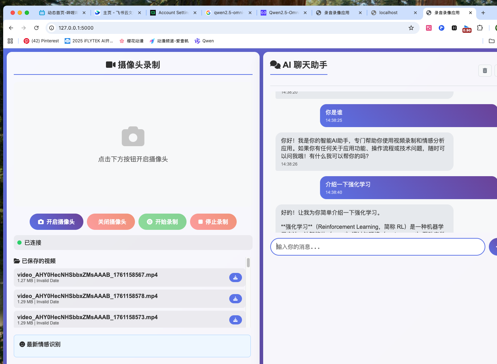

# 项目说明书

本说明书详细介绍“录音录像应用”的功能、架构与实现，帮助开发者和使用者快速理解与扩展本项目。


## 项目概述
- 基于 `Flask` 与 `Flask-SocketIO` 的实时录音录像与情感分析应用。
- 前端通过浏览器获取摄像头与麦克风数据，后端实现音视频缓存、合成与情感识别（优先 `LDDUService`，不可用时回退 `QwenService`）。
- 支持本地 `Qwen3-Omni` 模型推理或外部大模型 API 聊天。

## 功能清单
- 摄像头录制：开启/停止录制、实时预览、状态显示。
- 音视频处理：
  - 缓存最近 `5` 秒音视频数据。
  - 每秒合成一个短视频片段到 `videos/` 目录。
- 情感分析：合成视频完成后触发多模态情感分析，返回情感标签与描述。
- AI聊天：与外部大模型进行对话、历史记录管理与清除。
- 视频管理：列表查询、文件下载、静态访问。
- 系统状态：会话与处理器运行状态查询。

## 技术架构
- 后端：`Flask` Web + `Flask-SocketIO` 实时通信。
- 音视频：`OpenCV`、`ffmpeg-python`、`numpy`、`Pillow`。
- 模型：`transformers` 加载 `Qwen3-Omni / Qwen2.5-Omni`；可选 `vLLM`（已简化为GPU优先）。
- 前端：`HTML` + `CSS` + `JavaScript` + `Socket.IO`。

### 模块分工
- `app.py`：应用入口、HTTP路由与 SocketIO 事件处理。
- `config.py`：统一配置（端口、缓存参数、模型路径、API配置等）。
- `modules/openai_client.py`：外部大模型聊天客户端，含历史与降级策略。
- `modules/qwen_omni.py`：本地 Qwen Omni 推理器，负责视频/音频情感分析。
- `modules/qwen_service.py`：Qwen 模型服务（单例），封装加载与分析接口。
- `modules/video_queue.py`：会话级音视频缓冲队列（最长 10 秒）。
- `modules/video_processor.py`：异步视频合成与处理器状态维护。
- `modules/realtime_manager.py`：协调队列、处理器与模型服务的实时管线。
- `templates/index.html`：前端界面与交互逻辑。

## 目录结构
```
video_capture/
├── app.py                 # 主应用与路由/事件
├── config.py              # 配置项
├── modules/               # 业务模块
│   ├── openai_client.py   # Chat API 客户端
│   ├── qwen_omni.py       # 本地模型推理器
│   ├── qwen_service.py    # 模型服务（单例）
│   ├── realtime_manager.py# 实时管线协调
│   ├── video_processor.py # 视频合成与任务队列
│   └── video_queue.py     # 会话队列与状态
├── templates/index.html   # 前端页面
├── README.md              # 概要说明
├── requirements.txt       # 依赖
└── videos/                # 合成视频输出
```

## 启动流程
1. 运行 `python app.py`。
2. 初始化 OpenAI 客户端（若配置可用）。
3. 初始化 `RealtimeManager`：
   - 创建 `VideoQueueManager` 与 `VideoProcessor`。
   - 加载 LDDU 服务（HumanOmni + LDDU 模型），若失败则加载 Qwen 模型（GPU优先）。
4. 启动 SocketIO 服务（`debug=False`, `use_reloader=False`，避免重复加载）。

## 核心实现详解

### app.py
- HTTP 路由：
  - `GET /`：主页。
  - `GET /videos`、`GET /api/videos`：视频列表（遍历 `videos/`）。
  - `GET /videos/<filename>`：静态文件下载。
  - `POST /api/chat`：调用 `OpenAIClient.get_chat_response`，返回对话结果与会话ID。
  - `POST /api/chat/clear`：清除会话历史。
  - `GET /api/chat/history`：返回过滤后的历史（移除 `system`）。
  - `GET /status`：返回所有会话与视频处理器状态。
  - `GET /api/qwen/status`：返回模型服务状态（是否加载、错误、模型信息）。
  - `POST /api/qwen/analyze`：对指定 `video_path` 执行情感分析。
- SocketIO 事件：
  - `connect`/`disconnect`：会话连入/清理。
  - `start_recording`/`stop_recording`：控制实时处理循环开关。
  - `video_frame`：接收图像帧（base64），入队列。
  - `audio_chunk`：接收音频块（base64），入队列。
  - `get_session_status`：回传队列与处理状态。
- 重要启动参数：
  - `socketio.run(..., debug=False, use_reloader=False)`：防止重复加载模型。

### config.py
- 服务：`HOST`, `PORT`, `SECRET_KEY`，`DEBUG=False`（默认关闭）。
- 媒体：`FRAME_RATE=10`, `AUDIO_SAMPLE_RATE=44100`，码率与编码器。
- 缓存：`BUFFER_DURATION=5`（实时分析窗口），`SAVE_INTERVAL=1`（每秒合成）。
- 模型：`QWEN_MODEL_PATH`、`MAX_GPUS`、`LLM_*` 配置（兼容旧变量）。
- WebSocket：`SOCKETIO_ASYNC_MODE='threading'`，`CORS='*'`。

### modules/video_queue.py
- `VideoQueue(max_duration=10)`：维护 `deque` 队列，分别存储视频帧与音频块。
- 定时清理过期数据（最长保留 10 秒）。
- `get_recent_data(duration=5.0)`：读取最近 5 秒片段用于合成与分析。
- `VideoQueueManager`：按 `session_id` 管理多会话队列。

### modules/video_processor.py
- 内部队列 + 工作线程：`start_worker()` 启动守护线程，持续处理队列任务。
- 每个任务执行：
  - 组帧与音频对齐、调用 `ffmpeg` 合成、输出到 `videos/`。
- `get_status()`：返回运行与队列状态。

### modules/qwen_service.py
- 单例服务：避免多次加载模型，线程锁保护加载过程。
- 核心方法：
  - `load_model(model_path, device='auto', max_gpus=4)`：加载并缓存模型实例。
  - `is_model_ready()`：检查模型与处理器均已就绪。
  - `analyze_video_emotion(video_path, audio_path=None, prompt=None)`：调用推理器分析视频。
  - `analyze_audio_emotion(audio_path, prompt=None)`：调用推理器分析音频。
  - `get_status()`：返回加载状态与模型信息。
  - `unload_model()`：卸载资源与清空缓存。
- 去除了“热重载”接口，简化服务稳定性与可维护性。

### modules/qwen_omni.py
- `LocalQwenOmni`：根据模型路径自动判定类型（Qwen3/Qwen2.5）。
- 加载策略：
  - 优先 GPU，`device_map='auto'`，`torch_dtype=torch.float16`。
  - 可选 `vLLM`：`tensor_parallel_size=min(max_gpus, torch.cuda.device_count())`。
- 推理流程：
  - 视频：提取关键帧（最多 8 帧）+ 可选音频，构造多模态对话，生成情感文本。
  - 解析：中文关键词映射至英文标签（`happy/sad/angry/...`），返回结构化结果。
  - 音频：同样构造对话输入，生成并解析情感。

### modules/realtime_manager.py
- 管线调度：
  - 管理会话线程与回调；每会话一个实时处理循环。
  - 循环逻辑：每秒读取 `VideoQueue` 最近 5 秒数据，提交到 `VideoProcessor` 合成。
  - 合成完成触发：若模型就绪，异步执行情感分析，事件回推到前端。
- 资源管理：停止/清理会话、关闭处理器、汇总状态。

### templates/index.html
- 左侧：视频预览与操作按钮（开启摄像头、开始/停止录制）。
- 右侧：聊天窗口与工具栏（历史、清空、状态）。
- 通过 `Socket.IO` 发送 `video_frame`/`audio_chunk`，接收 `emotion_result` 与状态事件。

### 自适应图像清晰度与帧率
- 动机：在网络不稳定或带宽有限时，降低延迟并保持可用性。
- 实现要点：
  - 后端在 `video_frame` 事件返回 `video_frame_ack`，携带 `server_ts`、前端 `client_ts`、队列状态 `queue_info`。
  - 前端在 `startSendingFrames` 中监听 `video_frame_ack`，计算平均 RTT 与队列大小，动态调整：
    - JPEG质量 `quality`：在 `[0.4, 0.9]` 范围内增减。
    - 分辨率缩放 `scale`：在 `[0.6, 1.0]` 范围内增减（最小分辨率约 `320x240`）。
    - 帧发送间隔 `interval`：在 `[80ms, 300ms]` 范围内调整。
  - 触发条件：`avgRTT > 250ms` 或队列数据量过大时降清晰度与提高间隔，否则逐步恢复。
- 作用：在弱网时显著降低带宽占用与服务器压力，提升实时反馈速度。

#### 自适应网络传输图片加载（技术细节）
- 事件交互：
  - 前端发送 `video_frame`：`{ frame: <base64>, client_ts: <ms> }`。
  - 后端返回 `video_frame_ack`：`{ session_id, server_ts, client_ts, queue_info }`。
  - `queue_info` 字段：`video_frames`、`audio_chunks`、`video_duration`、`audio_duration`、`max_duration`（来自 `VideoQueue.get_queue_info()`）。
- RTT与负载估计：
  - RTT近似计算：`rtt_ms ≈ Date.now() - client_ts`（无需时钟同步）。
  - 平滑策略：维护滑动平均或最近N次均值，避免瞬时波动造成频繁切换。
  - 负载指标：优先使用 `queue_info.video_duration` 与 `queue_info.video_frames` 作为后端压力的代理变量。
- 自适应调节策略：
  - 降级条件（满足其一）：`avgRTT > 250ms`、`video_duration > 4s`、`video_frames > 30`。
  - 降级动作：`quality -= 0.05`（下限 `0.4`）、`scale -= 0.05`（下限 `0.6`）、`interval += 20ms`（上限 `300ms`）。
  - 升级条件（同时满足）：`avgRTT < 180ms` 且队列负载低。
  - 升级动作：`quality += 0.05`（上限 `0.9`）、`scale += 0.05`（上限 `1.0`）、`interval -= 20ms`（下限 `80ms`）。
- 图片生成与加载：
  - 使用 `canvas` 按 `scale` 缩放绘制 `<video>` 帧，然后 `canvas.toDataURL('image/jpeg', quality)` 生成DataURL。
  - 建议按需切换至 `canvas.toBlob()` + `FileReader.readAsDataURL` 或二进制传输（`ArrayBuffer`），在弱网时进一步减少字符串膨胀与编码开销。
- 前端实现参考：
  - 伪代码（关键逻辑）：
```
let quality=0.8, scale=1.0, interval=100; // 初始值
let avgRTT=0, rtts=[];

socket.on('video_frame_ack', (ack) => {
  const rtt = Date.now() - ack.client_ts;
  rtts.push(rtt); if (rtts.length>10) rtts.shift();
  avgRTT = rtts.reduce((a,b)=>a+b,0)/rtts.length;
  const q = ack.queue_info || {};
  const highLoad = (avgRTT>250) || (q.video_duration>4) || (q.video_frames>30);

  if (highLoad) {
    quality = Math.max(0.4, quality - 0.05);
    scale   = Math.max(0.6, scale   - 0.05);
    interval= Math.min(300, interval+20);
  } else {
    quality = Math.min(0.9, quality + 0.05);
    scale   = Math.min(1.0, scale   + 0.05);
    interval= Math.max(80,  interval-20);
  }
});

function captureFrame(videoEl, canvasEl){
  const w = Math.floor(videoEl.videoWidth * scale);
  const h = Math.floor(videoEl.videoHeight * scale);
  canvasEl.width=w; canvasEl.height=h;
  const ctx = canvasEl.getContext('2d');
  ctx.drawImage(videoEl, 0, 0, w, h);
  const dataURL = canvasEl.toDataURL('image/jpeg', quality);
  socket.emit('video_frame', { frame: dataURL, client_ts: Date.now() });
}

let timer=null;
function startSendingFrames(){
  if (timer) return;
  timer = setInterval(()=>captureFrame(videoEl, canvasEl), interval);
}
```
- 防抖与保护：
  - 参数调整节流：限制最短调整周期（如 200ms），避免过度抖动。
  - ACK超时保护：连续1秒无ACK时，临时提高 `interval` 并减小 `quality`，待恢复后逐步回升。
- 配置与扩展：
  - 初始值、上下限与阈值可在前端常量中统一配置，便于不同网络环境调优。
  - 后续可引入带宽探测、分层档位（如 `low/medium/high` profiles），或改用二进制WebSocket以进一步降低开销。

## 数据采集与模型检测

### 前端数据采集与传输
- 视频采集：
  - 使用 `getUserMedia` 获取摄像头视频流，绘制到 `canvas`。
  - 通过 `canvas.toDataURL('image/jpeg', 0.8)` 生成 JPEG 的 DataURL。
  - 每 100ms 调度一次发送（约 10fps）：`socket.emit('video_frame', { frame: frameData })`。
- 音频采集（并行两条路径）：
  - `MediaRecorder` 路径：`audio/webm;codecs=opus`，每 100ms 生成 `Blob`，用 `FileReader.readAsDataURL` 转为 DataURL 后发送：`socket.emit('audio_chunk', { audio: dataURL })`。
  - `AudioContext + AnalyserNode` 路径：`getByteFrequencyData` 取频谱幅值，`Uint8Array` 转 base64（`btoa`），每 50ms 发送：`socket.emit('audio_chunk', { audio: base64 })`。
- 会话标识：前端不显式传 `session_id`；后端使用 `request.sid` 识别连接并按房间回推结果。

### 后端接收、入队与合成
- 视频帧接收：`@socketio.on('video_frame')` 在 `app.py` 去除 `data:image/...;base64,` 前缀，将纯 base64 入队：`RealtimeManager.add_video_frame(session_id, frame_data)`。
- 音频块接收：`@socketio.on('audio_chunk')` 做清洗（去前缀、补齐 `=` 填充、移除非法字符），`base64.b64decode` 得到字节，入队：`RealtimeManager.add_audio_chunk(session_id, audio_bytes)`。
- 队列管理：`VideoQueue` 以时间戳缓存最近 10 秒音视频；`RealtimeManager` 每秒取最近 5 秒数据，提交到 `VideoProcessor`。
- 视频合成：
  - 解码帧：`base64.b64decode` → `np.frombuffer` → `cv2.imdecode` 得到图片矩阵，统一尺寸后用 `cv2.VideoWriter`（`FRAME_RATE=10`）写临时视频。
  - 音频写入：将队列中的字节拼接写 WAV（单声道、16 位、`44100Hz`）。若前端发送 `audio/webm;opus`，应在后端先用 `ffmpeg` 解码为 PCM 再写入 WAV，否则音频可能无效。
  - 合并输出：若存在临时音频，使用 `ffmpeg` 合并为最终视频（通常 `libx264 + aac`），保存到 `videos/` 目录。

### 模型就绪检测与情感分析
- 模型服务单例：`LDDUService`（HumanOmni + LDDU），若初始化失败则回退到 `QwenModelService`。
- 就绪检测：分别检查 LDDU 或 Qwen 服务是否就绪；`GET /api/qwen/status` 返回 Qwen 状态，LDDU 在初始化成功后由日志提示。
- 触发流程：`RealtimeManager` 在合成完成回调 `_on_video_composed` 中，优先异步调用 `_analyze_emotion_async_lddu(session_id, video_path)`，若不可用则调用 `_analyze_emotion_async`（Qwen）。
- 分析实现（统一简化）：后端仅返回标签文本，不包含置信度：`{'emotion': '<标签>', 'video_name': '实时分析', 'timestamp': <ts>}`。
- 结果回推：通过 `socketio.emit('emotion_result', payload, room=session_id)` 发送到对应前端会话，前端渲染仅显示标签。

## API 与事件

### HTTP 路由
- `GET /videos`：返回 `videos/` 中的文件列表与元数据。
- `GET /api/videos`：同上（用于前端统一接口）。
- `POST /api/chat`：`{"message":"...","session_id":"..."}` → `{response, timestamp, session_id, api_available}`。
- `POST /api/chat/clear`：清除指定会话历史。
- `GET /api/chat/history?session_id=...`：返回最近历史（不含 `system`）。
- `GET /status`：返回所有会话与处理器状态。
- `GET /api/qwen/status`：返回模型服务状态与信息。
- `POST /api/qwen/analyze`：`{"video_path":"..."}` → 情感结果。

### SocketIO 事件
- `connect` / `disconnect`
- `start_recording` / `stop_recording`
- `video_frame`：`{frame: <base64 image>}`
- `audio_chunk`：`{audio: <base64 data>}`（自动清理前缀、补齐 `=` 填充）
- `get_session_status` → `session_status`

## 安装与运行
- 依赖安装：`pip install -r requirements.txt`
- 环境变量（`.env` 可选）：
  - `OPENAI_API_KEY`、`OPENAI_API_BASE`、`OPENAI_MODEL`
  - `QWEN_MODEL_PATH`（本地模型路径）
- 启动：`python app.py`，访问 `http://localhost:5000`

## 常见问题与排查
- 模型重复加载：已通过 `debug=False` 与 `use_reloader=False` 解决。
- Base64 音频解码错误：确保去除 `data:audio...` 前缀并补齐 `=` 填充。
- GPU/显存不足：调整 `max_gpus` 与 `tensor_parallel_size`，或关闭 `vLLM`。
- 处理器警告（`rope_parameters`）：由模型/框架版本差异引起，不影响主要功能。

## 测试与示例
- `test_video_emotion.py`：加载 `Qwen3-Omni`，对 `videos/` 中视频执行多模态情感分析，打印结果。
- 前端演示：在主页开启摄像头录制，查看实时情感回推与视频列表。

## 设计原则与演进
- 简化设备与加载逻辑，聚焦 GPU 场景与自动映射。
- 通过服务单例与线程锁避免重复加载与资源泄漏。
- 以模块化架构确保可维护性与扩展性（替换模型、加强处理器）。